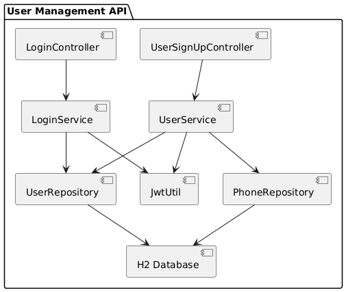
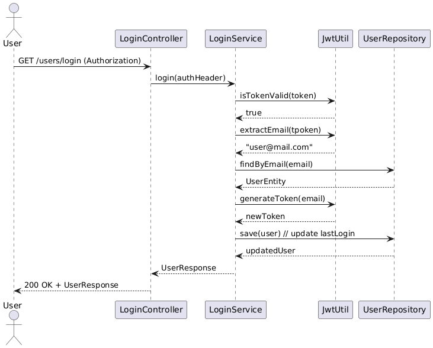
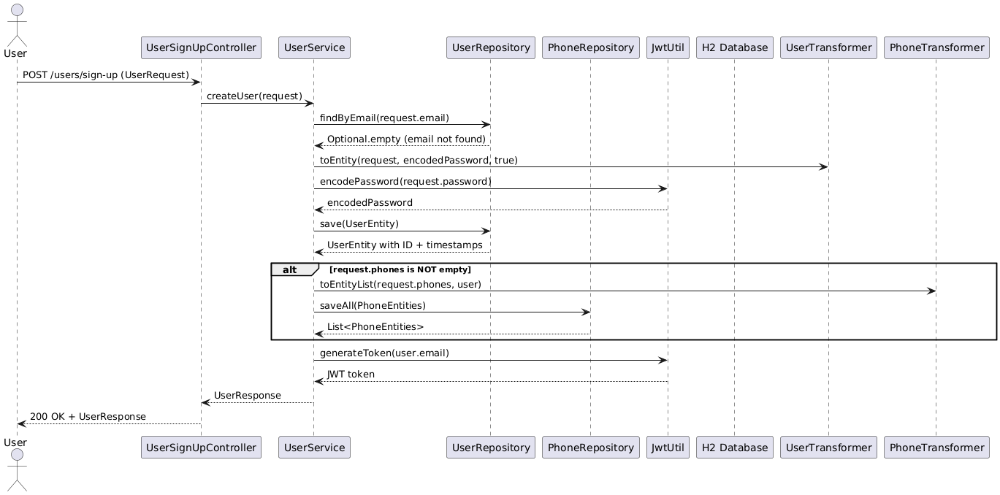

# User Management API

This project is a Spring Boot RESTful API that allows user sign-up and login using JWT-based authentication. It uses an in-memory H2 database.

---

## Technologies

- Java 11
- Spring Boot 2.5.14
- Gradle 7.4
- H2 Database
- Spring Data JPA
- Spring Security (JWT)
- SLF4J for logging

---

## Build Instructions

Make sure you have:

- Java 11
- Gradle 7.4

### Build the Project

```bash
./gradlew build
```

### Run the Project locally
```bash
./gradlew bootRun
```
The application will be available at:
http://localhost:8080

### Run the Jacoco report
```bash
./gradlew test jacocoTestReport
```
After running the command, open this file in your browser to see the jacoco report:
```
build/reports/jacoco/test/html/index.html
```

## Endpoints

### sign-up
Registers a new user.
```
POST /users/sign-up
```

### login
Retrieves user info using a valid JWT token (sent as Authorization: Bearer <token>)
```
GET /users/login
```

## API Documentation (Swagger)

This project includes auto-generated API documentation using **Swagger UI**.

### Access the Swagger UI

After starting the application, open your browser and navigate to:
http://localhost:8080/swagger-ui.html

### Swagger Setup

Swagger is configured to:
- Document all public API endpoints
- Allow testing endpoints directly from the browser
- Support JWT token authentication via the **Authorize** button

### Using JWT with Swagger

1. After Signing up, take the retrieved token.
2. Click the **Authorize** button (top-right corner).
3. Enter your token in the prompted modal.
4. Submit the form.
5. Swagger will include the token in the `Authorization` header of all secured endpoint requests.

## Architecture Diagrams
The architecture and sequence diagrams included in this project were created using the following free web-based tool:

PlantText UML Live Editor – for .puml text-based diagrams (component and sequence diagrams)

https://www.planttext.com/

All source files are located under the /diagrams directory and can be opened or edited in the respective tool.

### Component Diagram


### Login Sequence


### Sign-up Sequence



